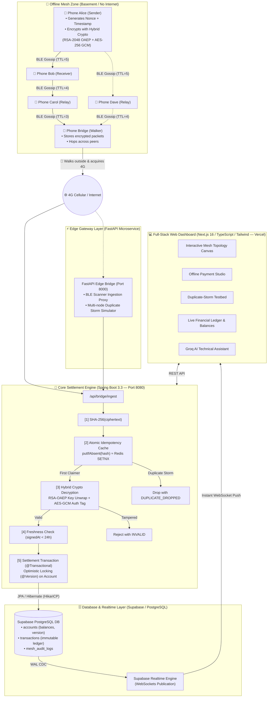

# 📡 UPI Offline Mesh — Full-Stack Production Showcase

[](https://github.com/pranshu-rajan/upi-offline-mesh/actions)
[](https://upi-offline-rho.vercel.app)
[](https://upi-offline-mesh-rrm4.onrender.com/api/server-key)
[](https://supabase.com)


> **Decentralized offline UPI payments routed through a Bluetooth Mesh network.**
>
> You're in an underground basement with zero cellular connectivity. You send ₹500 to a friend. Your phone encrypts the transaction, broadcasts it over Bluetooth Mesh, and the packet hops device-to-device through stranger devices until *one* device walks outside, acquires 4G internet, and silently uploads the packet to the settlement backend. The backend cryptographically verifies, deduplicates against concurrent duplicate storms, and settles the ledger into **Supabase PostgreSQL** with instant push updates to the web dashboard via **Supabase Realtime WebSockets**.

### 🔗 Live Production Deployments
- **Live Web Dashboard (Vercel)**: [https://upi-offline-rho.vercel.app](https://upi-offline-rho.vercel.app)
- **Live Settlement Engine (Render)**: [https://upi-offline-mesh-rrm4.onrender.com](https://upi-offline-mesh-rrm4.onrender.com)
- **Database Layer**: [Supabase PostgreSQL & Realtime](./supabase/README.md) (with automated zero-config H2 in-memory fallback for local dev & testing)

---

## 🏗 System Architecture



---

## 🎯 The Three Hard Problems and How They're Solved

### 1. Untrusted Intermediaries
*A random stranger's phone carries your transaction. How do you prevent eavesdropping or tampering?*
- **Solution: Hybrid RSA-OAEP + AES-256-GCM Encryption.**
- The sender generates an ephemeral AES-256 key, encrypts the JSON payload with authenticated **AES-256-GCM**, and wraps the AES key with the server's **RSA-2048 (OAEP-SHA256)** public key.
- Intermediaries only see an opaque ciphertext blob. If an attacker flips a single bit, the GCM authentication tag fails on the server and the packet is immediately rejected as `INVALID`.

### 2. The Duplicate-Storm (Concurrent Deliveries)
*Three bridge nodes hold the same packet. They all walk outside at the exact same second and POST simultaneously.*
- **Solution: Atomic compare-and-set on the ciphertext SHA-256 hash.**
- Before doing expensive RSA decryption, the server computes `SHA-256(ciphertext)` and atomically claims the hash in an idempotency cache via `putIfAbsent` (equivalent to Redis `SETNX`).
- Exactly **one** thread succeeds and settles; the remaining concurrent uploads are rejected instantly with `DUPLICATE_DROPPED`.
- Backed by a unique database constraint on `transactions.packet_hash` as defense-in-depth.

### 3. Replay Attacks
*An attacker intercepts a legitimate encrypted payment packet and broadcasts it weeks later.*
- **Solution: Dual-layer freshness envelopes.**
- Inside the authenticated payload is a millisecond timestamp (`signedAt`). The server rejects packets older than 24 hours.
- Inside the payload is a random UUID `nonce`. Legitimately repeated payments generate different nonces, producing distinct ciphertexts and hashes.

---

## 🚀 Quickstart

### Option A: 1-Click Full-Stack Docker Compose (Recommended)

Run the entire ecosystem (Spring Boot core, Next.js frontend, and FastAPI gateway) with one command:

```bash
docker compose up --build
```

- **Next.js Interactive Dashboard**: [http://localhost:3000](http://localhost:3000)
- **Spring Boot Core API**: [http://localhost:8080](http://localhost:8080)
- **FastAPI Edge Gateway (Swagger UI)**: [http://localhost:8000/docs](http://localhost:8000/docs)
- **H2 Database Console**: [http://localhost:8080/h2-console](http://localhost:8080/h2-console) (`jdbc:h2:mem:upimesh`, user: `sa`, no password)

---

### Option B: Run Locally Without Docker

#### 1. Start the Core Settlement Backend (Java 17+)
```bash
# Windows
.\mvnw.cmd spring-boot:run

# Mac/Linux
./mvnw spring-boot:run
```
Backend starts on `http://localhost:8080`.

#### 2. Start the Modern Next.js Frontend (Node 18+)
```bash
cd frontend
npm install
npm run dev
```
Dashboard starts on `http://localhost:3000`.

#### 3. Start the FastAPI Edge Bridge (Optional, Python 3.10+)
```bash
cd gateway
pip install -r requirements.txt
python main.py
```
Edge gateway runs on `http://localhost:8000`.

---

## 🧪 Testing Concurrency & Cryptography

Run the backend test suite:

```bash
# Windows
.\mvnw.cmd test

# Mac/Linux
./mvnw test
```

### Key Automated Tests:
1. **`singlePacketDeliveredByThreeBridgesSettlesExactlyOnce`**: Fires 3 threads simulating 3 bridges uploading the same packet simultaneously. Asserts:
   - Exactly 1 `SETTLED`
   - Exactly 2 `DUPLICATE_DROPPED`
   - Sender's balance debited exactly once.
2. **`tamperedCiphertextIsRejected`**: Flips a bit in the AES-GCM ciphertext and asserts that `BridgeIngestionService` marks it `INVALID`.
3. **`encryptDecryptRoundTrip`**: Validates the full RSA-OAEP + AES-GCM hybrid encryption roundtrip.

---

## 📡 REST API Reference

### Core Settlement Engine (Spring Boot)

| Method | Endpoint | Description |
|---|---|---|
| `GET` | `/api/server-key` | Server's RSA public key (base64) & crypto spec |
| `POST` | `/api/demo/send` | Simulate sender: encrypt payload & inject into mesh |
| `GET` | `/api/mesh/state` | Current state of all virtual mesh devices |
| `POST` | `/api/mesh/gossip` | Execute one round of BLE device-to-device gossip |
| `POST` | `/api/mesh/flush` | Bridges with 4G upload held packets in parallel |
| `POST` | `/api/mesh/reset` | Clear mesh buffers and idempotency cache |
| `POST` | `/api/bridge/ingest` | **Production ingestion endpoint** for bridge nodes |
| `GET` | `/api/accounts` | All user accounts and live balances |
| `GET` | `/api/transactions` | Top 20 settled transactions in the ledger |

#### Production Bridge Ingestion Request (`POST /api/bridge/ingest`)
```http
POST /api/bridge/ingest HTTP/1.1
Content-Type: application/json
X-Bridge-Node-Id: phone-bridge-42
X-Hop-Count: 3

{
  "packetId": "3fa85f64-5717-4562-b3fc-2c963f66afa6",
  "ttl": 2,
  "createdAt": 1726300000000,
  "ciphertext": "base64-encoded-RSA-wrapped-AES-GCM-packet"
}
```

Response:
```json
{
  "outcome": "SETTLED",
  "packetHash": "e3b0c44298fc1c149afbf4c8996fb92427ae41e4649b934ca495991b7852b855",
  "reason": null,
  "transactionId": 42
}
```

---

## 🗄️ Full-Stack Supabase Database Setup

The project natively integrates with **Supabase PostgreSQL** for persistent ledger storage and **Supabase Realtime** for sub-second push notifications to the dashboard:

1. **Schema Initialization**:
   - Run [`supabase/schema.sql`](./supabase/schema.sql) in your Supabase SQL Editor.
   - Sets up `accounts` with optimistic locking, `transactions` with idempotency indexes, RLS policies, and Realtime publications.
2. **Detailed Setup Guide**:
   - See [`supabase/README.md`](./supabase/README.md) for full step-by-step instructions.

---

## ☁️ Cloud Deployment Guide

### 1. Deploying Frontend to Vercel
1. Push this repository to GitHub.
2. Import project in [Vercel](https://vercel.com) and set the **Root Directory** to `frontend`.
3. Configure Environment Variables in Vercel:
   - `NEXT_PUBLIC_API_URL`: `https://upi-offline-mesh-rrm4.onrender.com/api`
   - `NEXT_PUBLIC_SUPABASE_URL`: `https://your-project-ref.supabase.co`
   - `NEXT_PUBLIC_SUPABASE_ANON_KEY`: `your_supabase_anon_public_key`
   - `GROQ_API_KEY`: *(Optional)* Your Groq LLM API key for the live AI Technical Assistant
4. Deploy!

### 2. Deploying Backend to Render
1. In [Render](https://render.com), create a new **Web Service** connected to your repository.
2. Set runtime to **Docker** and specify `Dockerfile.backend` (or set Environment to Docker).
3. Set environment variables in Render:
   - `SERVER_PORT`: `8080`
   - `SPRING_DATASOURCE_URL`: `jdbc:postgresql://db.your-project-ref.supabase.co:5432/postgres?sslmode=require`
   - `SPRING_DATASOURCE_USERNAME`: `postgres`
   - `SPRING_DATASOURCE_PASSWORD`: `<your-supabase-db-password>`
   - `SPRING_JPA_HIBERNATE_DDL_AUTO`: `update`
4. Expose port `8080`.
*(Note: If no database credentials are supplied, the backend seamlessly falls back to H2 in-memory mode.)*

---

## ⚖️ Honest Real-World Constraints

This project is an engineering proof-of-concept demonstrating **mesh-routed deferred settlement**. Real-world constraints:
1. **Deferred Settlement vs Instant Guarantee**: In a true offline environment without pre-funded hardware wallets (like UPI Lite), the receiver cannot verify if the sender's account has funds until settlement reaches the core bank.
2. **Offline Double Spend**: A malicious sender could sign two payments in different physical basements. The first to reach the backend settles; the second gets rejected.
3. **OS Bluetooth Constraints**: Background BLE scanning and GATT connections on modern iOS/Android are heavily power-throttled.

---

## 📄 License

This project is licensed under the [MIT License](LICENSE).
